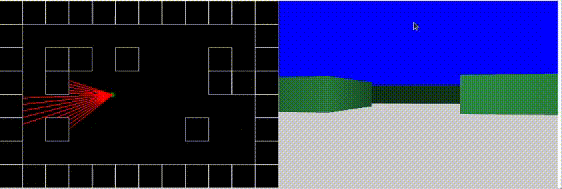

# RayCasting Example with JS :flashlight:



### Clone

- Clone this repo to your local machine using `https://github.com/abdelrhman-allam/raycasting-js.git`

### Setup

- If you want more syntax highlighting, format your code like this:

> Install npm packages

```shell
$ npm install
```

> Start the development server

```shell
$ npm run start
```

### Modify for fun

`src/main.js`

```javascript
function Map() {
  this.tileSize = TILE;
  this.grid = [
    [1, 1, 1, 1, 1, 1, 1, 1, 1, 1, 1, 1],
    [1, 0, 0, 0, 0, 0, 0, 0, 0, 0, 0, 1],
    [1, 0, 1, 1, 0, 1, 0, 0, 0, 1, 0, 1],
    [1, 0, 1, 0, 0, 0, 0, 0, 0, 1, 1, 1],
    [1, 0, 0, 0, 0, 0, 0, 0, 0, 0, 0, 1],
    [1, 0, 1, 0, 0, 0, 0, 0, 1, 0, 0, 1],
    [1, 0, 0, 0, 0, 0, 0, 0, 0, 0, 0, 1],
    [1, 1, 1, 1, 1, 1, 1, 1, 1, 1, 1, 1],
  ];

  this.worldMap = [];

  for (let i = 0; i < this.grid.length; i++) {
    for (let j = 0; j < this.grid[i].length; j++) {
      if (this.grid[i][j] == 1)
        this.worldMap.push([i * this.tileSize, j * this.tileSize]);
    }
  }
}
```
